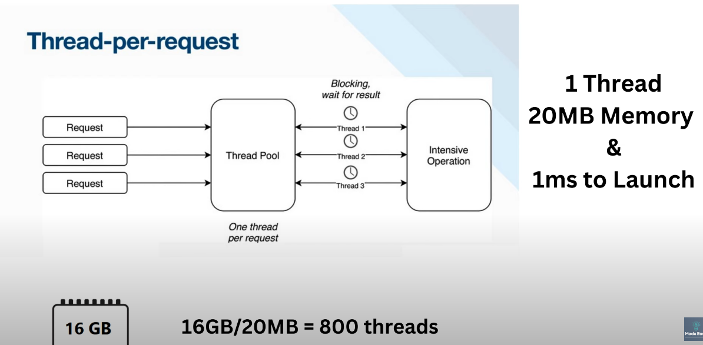
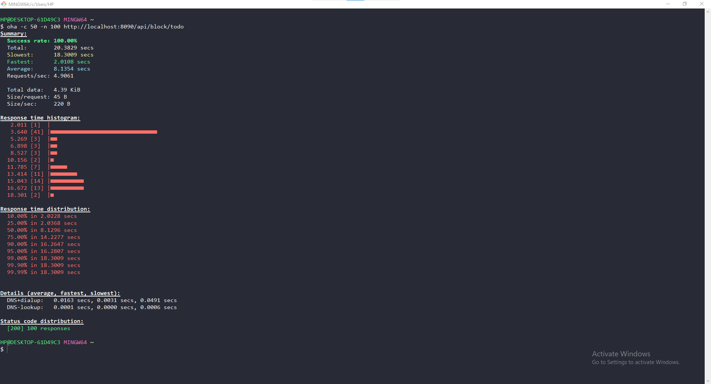
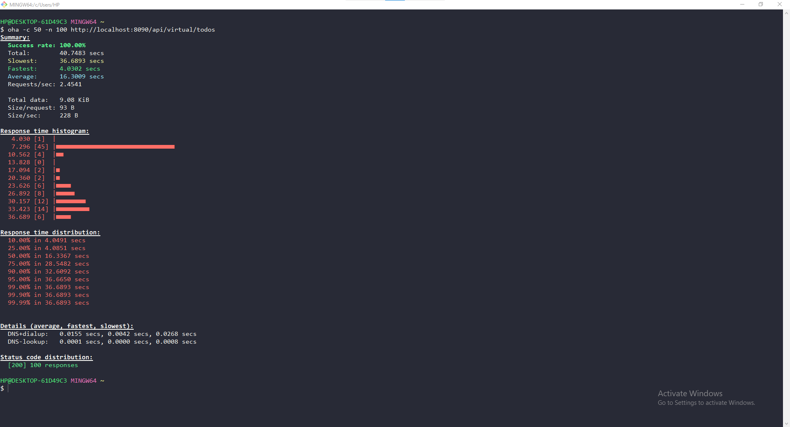
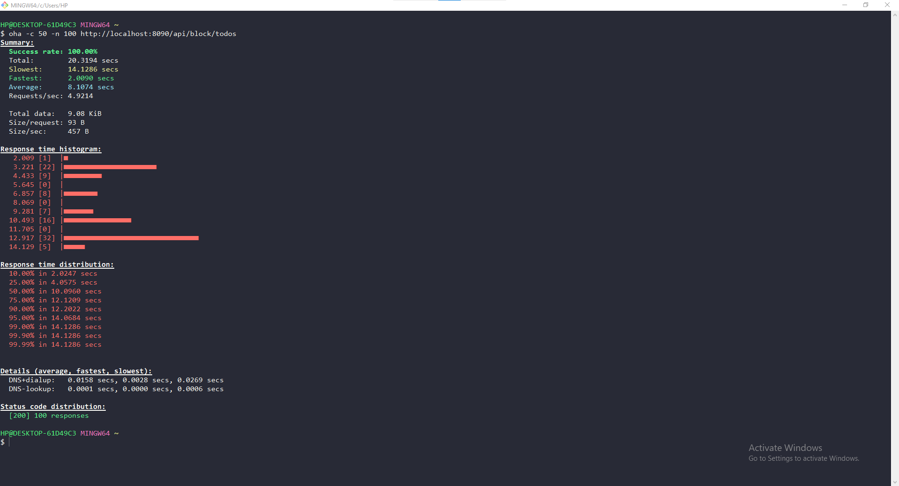
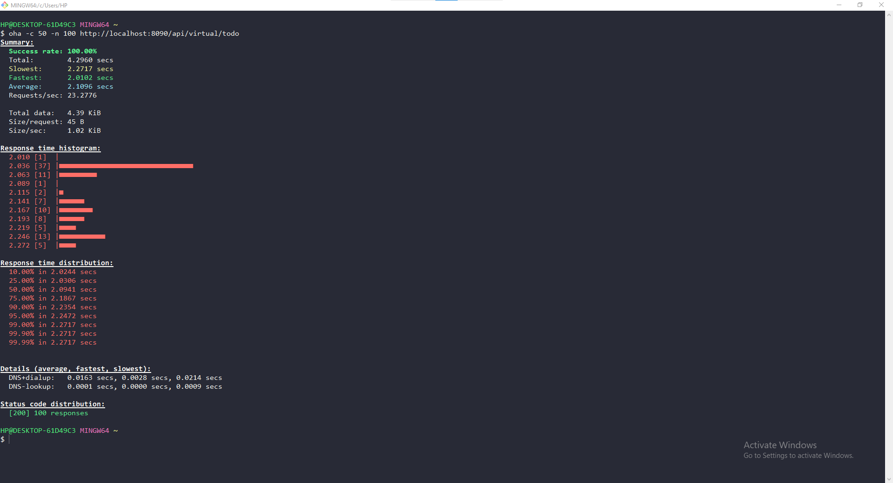
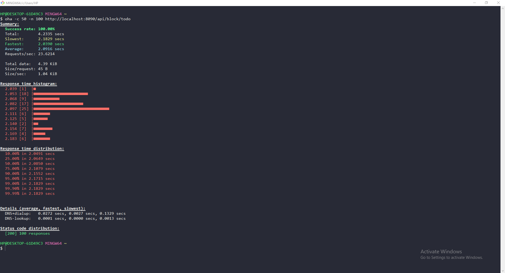
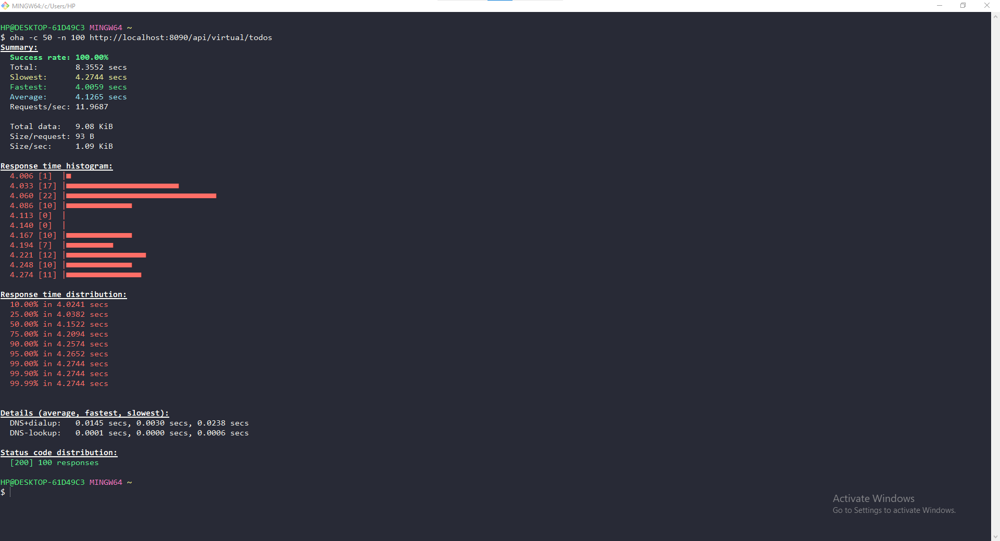
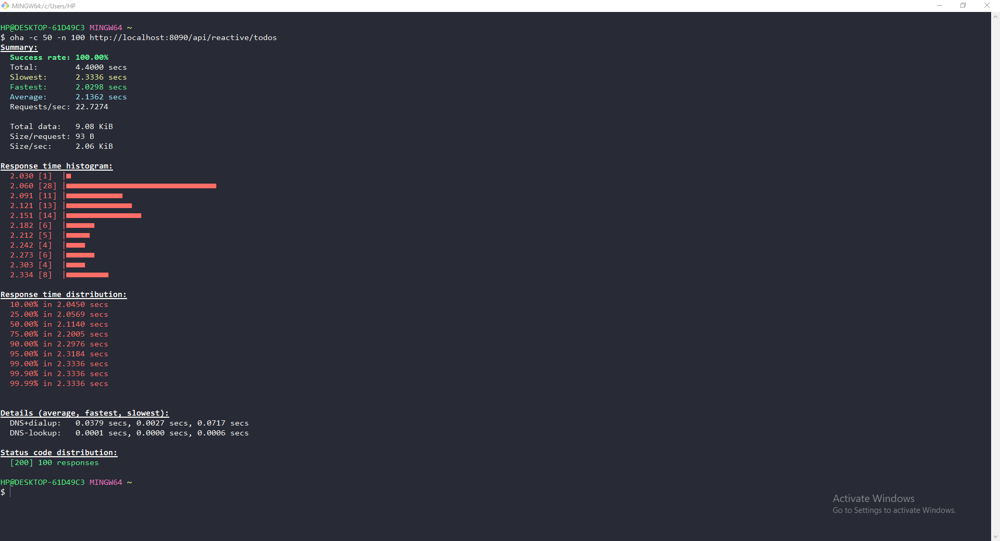

# Cost of platform thread

# Performance without virtual threads

## Rest Client

## Reactive

## Reactive with block

## Multiple calls with Rest Client

## Multiple calls with Reactive

## Multiple calls with Reactive block

# Performance with virtual threads

## Rest Client

## Reactive

## Reactive with block

## Multiple calls with Rest Client

## Multiple calls with Reactive

## Multiple calls with Reactive block

